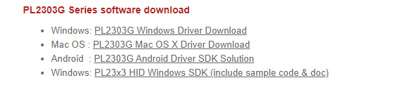
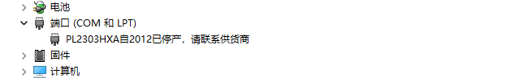
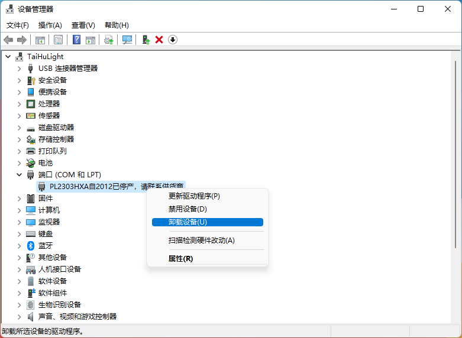
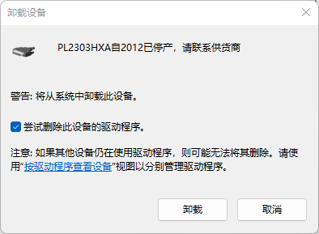

在淘宝整了一块FPGA的板子，应该是很多年前的库存了（对于我一个初学者来说，香的很!），它使用的USB转串口芯片是PL-2303HXA，但是这个型号已经停产了，所以在[Prolific官网](https://www.prolific.com.tw/US/ShowProduct.aspx?pcid=41&showlevel=0017-0037-0041)下载的最新驱动是无法使用的（感觉是厂家故意的...）。

因此需要找到旧版的驱动，但是又不能太旧，太旧的话对Windows10以上的系统支持不太好，因此需要找到一个合适的驱动。（你废话不要太多了😡！）

## 下载地址

[阿里云](https://www.aliyundrive.com/s/biGJbmC8TTR)

[百度云](https://pan.baidu.com/s/1P5yYXq0QW7O_bsdhL9Ljiw?pwd=gec0)

## 卸载驱动

如果已经安装过驱动，安装该驱动前请先把原来的驱动删掉。具体方法如下，

右击设备，点击"卸载设备"，在弹出的窗口中给"尝试删除此设备的驱动"打上勾。

## 安装驱动

直接双击运行。如果安装时可能还会弹出一个让你卸载驱动的窗口，按照他说的做就好了。卸载完重启一下，再重新安装。
