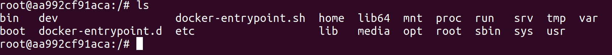
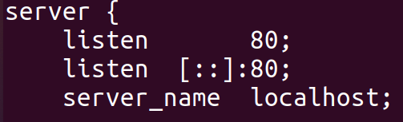

以nginx为例。
# 下载并安装docker
[官方文档](https://docs.docker.com/engine/install/ubuntu/#install-using-the-convenience-script)，直接使用[脚本安装](https://docs.docker.com/engine/install/ubuntu/#install-using-the-convenience-script)，我选择的是Ubuntu的Docker Engine版本。
很简单我就不演示了。
```bash
curl -fsSL https://get.docker.com -o get-docker.sh
sudo bash get-docker.sh
#就是把.sh文件下过来,再用bash打开
```
# nginx
## 拉取镜像
[nginx](https://hub.docker.com/_/nginx?tab=tags)在docker上的页面。
`sudo docker pull nginx:latest`
## 创建并启动容器
`sudo docker run -d --name nginx -p 80:80 -p 443:443 nginx:latest`
> 命令解析
> `run`：创建并运行一个容器
> `nginx:latest`：最后的这一条就是指定用哪一个镜像来创建容器，这里指定的就是nginx。
> `-d`：让容器在后台运行。
> `--name`：给容器命名，因为一个镜像可以开多个容器。
> `-p`：指定端口映射，主机端口：容器端口，例如80：88，把主机的80端口映射到docker的88端口。例如nginx会监听80端口，那我就可以指定`-p 7474:80`那么`localhost:7474`也会进入nginx的主页。`-p`可以指定多个端口映射。

[docker的其他指令](https://www.runoob.com/docker/docker-run-command.html)
# 进入容器内部
`docker exec -it nginx /bin/bash`
> `exec`：在运行的容器中执行命令
> `-i`：开启标准输入，STDIN
> `-t`：分配一个虚拟终端，TTY
> `nginx`：指定容器
> `/bin/bash`：将这条命令放进容器里执行，就是打开bash

这样就可以在容器的内部直接操作容器了。


# 宿主机与容器共享文件

1. 先创建一个nginx容器，把里面的配置文件拷贝出来。
1. 删除原来的nginx容器。
1. 在主机上创建`www/html`目录，作为网站的根目录。
1. 新建一个nginx容器，将之前复制出来的文件和`www/html`共享给nginx容器。
## 准备共享的文件
### 在主机上创建共享目录
我的习惯是跟据nginx原来的目录结果，建个差不多的。
```bash
sudo mkdir -p /mnt/nginx/html/
# 网站根目录
sudo mkdir -p /mnt/nginx/logs/
# 保存日志文件
sudo mkdir -p /mnt/nginx/conf.d/
# 有一个配置文件会放在该目录下
```
### 拷贝配置文件
先将容器中的配置文件拷贝出来，将容器nginx内的`nginx.conf`和`default.conf`分别复制到`/mnt/nginx`和`/mnt/nginx/conf.d/`目录下。
`/mnt`目录是专门用来挂载的，那么将容器中的文件链接到主机，也能算挂载吧，所以放在这个目录下。
```bash
sudo docker cp nginx:/etc/nginx/nginx.conf /mnt/nginx/
sudo docker cp nginx:/etc/nginx/conf.d/default.conf /mnt/nginx/conf.d/

#	cp 命令如果目的地地址的末尾是个目录的话，文件会按原来的名字放进该目录。否则改成末尾的文件名。
#	比如这里conf.d/是个目录，那就是将default.conf放进该目录下。
# 如果去掉/符号，也就是将conf.d当作一个文件名，那么default.conf会被改名成conf.d并放在nginx/目录下
```
> `cp`：指定容器目录，`[容器名或容器ID]:[容器内的目录或文件]`
> `cp`命令可以在容器和主机之间双向拷贝。

当前的目录结构
```bash
$ tree
.
└── nginx
    ├── conf.d
    │   └── default.conf
    ├── html
    ├── logs
    └── nginx.conf
```
#### 停止并移除该容器
```bash
sudo docker stop nginx
sudo docker rm nginx
```
## 创建一个新的容器
查看刚刚复制出来的配置文件，查看需要映射的目录，也就是日志目录、服务器根目录以及配置文件。
```bash
/var/log/nginx/
#nginx的日志目录

/etc/nginx/nginx.conf
/etc/nginx/conf.d/default.conf
#配置文件

/usr/share/nginx/html/
#服务器根目录
```
默认监听的是80端口，所以只要开一个80端口就行了。


```bash
sudo docker run \
  -d --name nginx \
  --restart=always \
  -p 80:80 \
  -v /mnt/nginx/nginx.conf:/etc/nginx/nginx.conf \
  -v /mnt/nginx/conf.d/:/etc/nginx/conf.d/ \
  -v /mnt/nginx/logs/:/var/log/nginx/ \
  -v /mnt/nginx/html/:/usr/share/nginx/html \
  --privileged nginx:latest
```
> `-v`：绑定一个卷volume，或者说主机共享目录或文件。`[主机目录或文件]:[容器目录或文件]`
> `--restart`：这个可以设置容器的启动模式，如果一个容器被设置成设置成`always`那么docker重启时，该容器也会被自动重启，总之就是保证容器一直都是开启的状态。因为服务器是要一直开着的，所以就设置为always。[文档](https://docs.docker.com/config/containers/start-containers-automatically/#use-a-restart-policy)
> `--privileged`：授予容器所有的权限，比如写入主机目录下的文件（共享的那几个目录）。
> `\`：可以给命令分行

往`/mnt/nginx/html`里面写一个`index.html`，看看效果。
