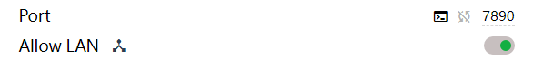
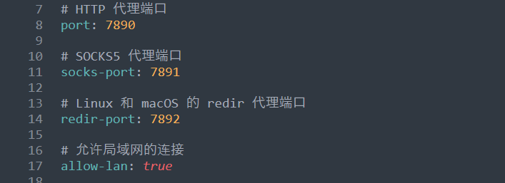
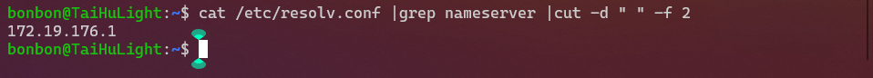
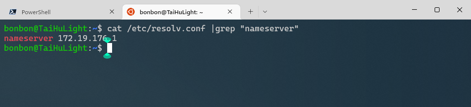
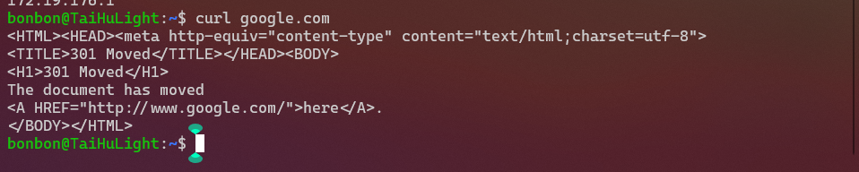

# clash设置

需要允许局域网连接


以及代理端口号，这个在clash home目录的`./profiles/xxx.yml`配置文件（我的文件名是一串数字）里可以看到。

clash可以直接打开`home/`目录。


在配置文件查看端口。


# wsl设置

添加到`~/`目录下的`.bashrc`即可。

```bash
# 设置clash代理
# 自动获取IP地址
host_ip=$(cat /etc/resolv.conf |grep "nameserver" |cut -d " " -f 2)
# ALL_PROXY,应该是表示全局代理
export ALL_PROXY="http://$host_ip:7890"
```
## 自动获取IP地址

`cat /etc/resolv.conf |grep "nameserver" |cut -d " " -f 2`


### `cut`介绍

> Usage: cut OPTION... [FILE]...
>
> Use one, and only one of -b, -c or -f.  Each LIST is made up of one range, or many ranges separated by commas.  Selected input is written in the same order that it is read, and is written exactly once.

> cut 命令从文件的每一行（因此输出出来可能会有很多行）剪切字节、字符和字段并将这些字节、字符和字段写至标准输出。如果不指定 File 参数，cut 命令将读取标准输入。["菜鸟教程"](https://www.runoob.com/linux/linux-comm-cut.html)

因为`grep`可以定位到含有关键字的行，所以cut配置grep使用的话就能输出某一行的特定字符。

#### 参数

`-d`，自定义分隔符，默认为制表符。例如 `-d " "`就是用空格来做分隔符，`cut`会用分割符把内容分割成带序号的"区域"。

`-f`，这个要和`-d`参数配合使用，指定显示某一个区域。分隔符是不会显示的。

## 命令解析
首先，通过`cat /etc/resolv.conf |grep "nameserver"`命令可以获得，
`nameserver 172.19.176.1`


因为我们只想要后面的IP，所以还需要再处理一下。我们发现该字符串刚好被一个空格`" "`分为了两部分，而后面一部分正是我们想要的。因此想到`cut`命令并指定空格`" "`为分隔符。
`cut -d " " -f 2`在`cut`中第二部分的序号就是2，因此用`-f 2`命令来指定显示第二部分。

### 最后是变量

如果要用命令的输出（值）来作为bash的变量，则需要将命令写在`$()`内。并且bash变量的赋值，等号两边是不能有空格的。

# 注意

`ping`命令不会使用代理，所以`ping google.com`此时也是`ping`不通的。可以使用`curl`命令来测试。


